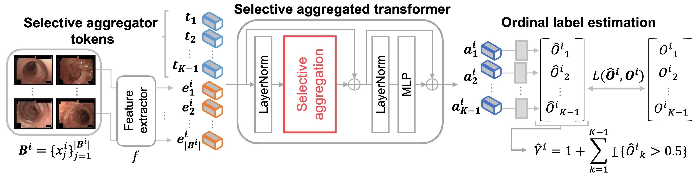

# Ordinal-Multiple-instance-Learning-for-Ulcerative-Colitis-Severity-Estimation
Ordinal Multiple-instance Learning for Ulcerative Colitis Severity Estimation with Selective Aggregated Transformer, in WACV2025.



Shikui Kaito, Kaszuya nishimura, Daiki Suehiro, Kiyohito Tanaka, Ryoma Bise
> Patient-level diagnosis of severity in ulcerative colitis (UC) is common in clinical, where the most severe score in a patient is recorded.
However, previous UC classification methods ({\it i.e.,} image-level estimation) mainly assumed the input was a single image. Thus, these methods can not utilize severity labels recorded in clinical practice.
In this paper, we propose a patient-level severity estimation method by a transformer with selective aggregator tokens, where a severity label is estimated from multiple images taken from a patient, similar to a clinical setting.
Our method can effectively aggregate features of severe parts from a set of images captured in each patient, and it facilitates improving the discriminative ability between adjacent severity classes.
Experiments demonstrate the effectiveness of the proposed method on two datasets compared with the state-of-the-art MIL methods.
Moreover, we evaluated our method in the clinical setting and confirmed that our method outperformed the previous image-level methods.

# Requirement
To set up their environment, please run:  
(we recommend to use [Anaconda](https://www.anaconda.com/) for installation.)
```
conda env create -n max_label -f max_label.yml
conda activate max_label
```

# Download dataset
Please download the LIMUC dataset from here
```
https://zenodo.org/records/5827695#.Yi8GJ3pByUk
```
# Make dataset
You can create datasets by running the following code. 
```
python ./make_bag/make_bags_LIMUC.py
python ./make_bag/crossvalidation_LIMUC.py
python ./make_bag/LIMUC_bag_time_ordering.py
```

# Training & Test for Selective Aggregated Transformer
After creating your python environment and Dataset which can be made by following above command, you can run Selective Aggregated Transformer code.
If you want to train a Selective aggregated transformer, please run following command. 5 fold training is automatically done in our code.
```
python ./script/main.py --dataset "LIMUC" --data_type "5-fold_in_test_balanced_time_order" --module "Selective_Aggregated_Transfomer" --batch_size 32 --transfomer_layer_num 1 --clstoken_mask 1 --is_evaluation 0 --device 'cuda:0' 
```
If you want to evaluate Selective aggregated transformer, please run following command. 5 fold trainevaluation is automatically done in our code.
```
python ./script/main.py --dataset "LIMUC" --data_type "5-fold_in_test_balanced_time_order" --module "Selective_Aggregated_Transfomer" --batch_size 32 --transfomer_layer_num 1 --clstoken_mask 1 --is_evaluation 1 --device 'cuda:0'
```
# Training & Test for comparison method
If you want to train the comparison methods, please run the following command.
```
python ./script/main.py --dataset "LIMUC" --data_type "5-fold_in_test_balanced_time_order" --module "output_mean" --is_evaluation 0 --device 'cuda:0'
python ./script/main.py --dataset "LIMUC" --data_type "5-fold_in_test_balanced_time_order" --module "output_max"  --is_evaluation 0 --device 'cuda:0'
python ./script/main.py --dataset "LIMUC" --data_type "5-fold_in_test_balanced_time_order" --module "Feat_agg" --feat_agg_method "mean" --is_evaluation 0 --device 'cuda:0'  
python ./script/main.py --dataset "LIMUC" --data_type "5-fold_in_test_balanced_time_order" --module "Feat_agg" --feat_agg_method "max" --is_evaluation 0 --device 'cuda:0'  
python ./script/main.py --dataset "LIMUC" --data_type "5-fold_in_test_balanced_time_order" --module "multi-class_Att_mil" --is_evaluation 0 --device 'cuda:0'
python ./script/main.py --dataset "LIMUC" --data_type "5-fold_in_test_balanced_time_order" --module "transfomer" --batch_size 32 --transfomer_layer_num 1 --is_evaluation 0 --device 'cuda:0' 
python ./script/main.py --dataset "LIMUC" --data_type "5-fold_in_test_balanced_time_order" --module "dsmil" --is_evaluation 0 --device 'cuda:0' 
python ./script/main.py --dataset "LIMUC" --data_type "5-fold_in_test_balanced_time_order" --module "additive_mil" --add_agg_method "TransMIL" --batch_size 32 --is_evaluation 0 --device 'cuda:0'
python ./script/main.py --dataset "LIMUC" --data_type "5-fold_in_test_balanced_time_order" --module "IBMIL" --is_evaluation 0 --device 'cuda:0' --c_path 
python ./script/main.py --dataset "LIMUC" --data_type "5-fold_in_test_balanced_time_order" --module "krank_mil" --emsemble_mode "threshold"  --is_evaluation 0 --device 'cuda:0' 
python ./script/main.py --dataset "LIMUC" --data_type "5-fold_in_test_balanced_time_order" --module "transfomer_reg" --batch_size 32 --transfomer_layer_num 1 --is_evaluation 0 --device 'cuda:0'
python ./script/main.py --dataset "LIMUC" --data_type "5-fold_in_test_balanced_time_order" --module "transfomer_softlabel" --batch_size 32 --transfomer_layer_num 1 --is_evaluation 0 --device 'cuda:0' 
python ./script/main.py --dataset "LIMUC" --data_type "5-fold_in_test_balanced_time_order" --module "transfomer_POE" --main-loss-type 'reg'  --num-output-neurons 1  --is_evaluation 0 --device 'cuda:0' 
python ./script/main.py --dataset "LIMUC" --data_type "5-fold_in_test_balanced_time_order" --module "transfomer_cpl" --constraint 'H-S' --metric_method 'C' --tau 0.13 --is_evaluation 0 --device 'cuda:0' 
python ./script/main.py --dataset "LIMUC" --data_type "5-fold_in_test_balanced_time_order" --module "transfomer_cpl" --constraint 'S-P' --metric_method 'C' --tau 0.11 --is_evaluation 0 --device 'cuda:0' 
python ./script/main.py --dataset "LIMUC" --data_type "5-fold_in_test_balanced_time_order" --module "transfomer_krank" --batch_size 32 --transfomer_layer_num 1 --clstoken_mask 1  --is_evaluation 0 --device 'cuda:0' 
```

If you want to evaluate comparison method, please run following command.
```
python ./script/main.py --dataset "LIMUC" --data_type "5-fold_in_test_balanced_time_order" --module "output_mean" --is_evaluation 1 --device 'cuda:0'
python ./script/main.py --dataset "LIMUC" --data_type "5-fold_in_test_balanced_time_order" --module "output_max"  --is_evaluation 1 --device 'cuda:0'
python ./script/main.py --dataset "LIMUC" --data_type "5-fold_in_test_balanced_time_order" --module "Feat_agg" --feat_agg_method "mean" --is_evaluation 1 --device 'cuda:0'  
python ./script/main.py --dataset "LIMUC" --data_type "5-fold_in_test_balanced_time_order" --module "Feat_agg" --feat_agg_method "max" --is_evaluation 1 --device 'cuda:0'  
python ./script/main.py --dataset "LIMUC" --data_type "5-fold_in_test_balanced_time_order" --module "multi-class_Att_mil" --is_evaluation 1 --device 'cuda:0' 
python ./script/main.py --dataset "LIMUC" --data_type "5-fold_in_test_balanced_time_order" --module "transfomer" --batch_size 32 --transfomer_layer_num 1 --is_evaluation 1 --device 'cuda:0' 
python ./script/main.py --dataset "LIMUC" --data_type "5-fold_in_test_balanced_time_order" --module "dsmil" --is_evaluation 1 --device 'cuda:0' 
python ./script/main.py --dataset "LIMUC" --data_type "5-fold_in_test_balanced_time_order" --module "additive_mil" --add_agg_method "TransMIL" --batch_size 32 --is_evaluation 1 --device 'cuda:0'
python ./script/main.py --dataset "LIMUC" --data_type "5-fold_in_test_balanced_time_order" --module "IBMIL" --is_evaluation 1 --device 'cuda:0' --c_path 
python ./script/main.py --dataset "LIMUC" --data_type "5-fold_in_test_balanced_time_order" --module "krank_mil" --emsemble_mode "threshold"  --is_evaluation 1 --device 'cuda:0' 
python ./script/main.py --dataset "LIMUC" --data_type "5-fold_in_test_balanced_time_order" --module "transfomer_reg" --batch_size 32 --transfomer_layer_num 1 --is_evaluation 1 --device 'cuda:0'
python ./script/main.py --dataset "LIMUC" --data_type "5-fold_in_test_balanced_time_order" --module "transfomer_softlabel" --batch_size 32 --transfomer_layer_num 1 --is_evaluation 1 --device 'cuda:0' 
python ./script/main.py --dataset "LIMUC" --data_type "5-fold_in_test_balanced_time_order" --module "transfomer_POE" --main-loss-type 'reg'  --num-output-neurons 1  --is_evaluation 1 --device 'cuda:0' 
python ./script/main.py --dataset "LIMUC" --data_type "5-fold_in_test_balanced_time_order" --module "transfomer_cpl" --constraint 'H-S' --metric_method 'C' --tau 0.13 --is_evaluation 1 --device 'cuda:0' 
python ./script/main.py --dataset "LIMUC" --data_type "5-fold_in_test_balanced_time_order" --module "transfomer_cpl" --constraint 'S-P' --metric_method 'C' --tau 0.11 --is_evaluation 1 --device 'cuda:0' 
python ./script/main.py --dataset "LIMUC" --data_type "5-fold_in_test_balanced_time_order" --module "transfomer_krank" --batch_size 32 --transfomer_layer_num 1 --clstoken_mask 1  --is_evaluation 1 --device 'cuda:0' 
```

# Citation
If you find this repository helpful, please consider citing:
```
```

# Author
@ Shiku Kaito  
・ Contact: kaito.shiku@human.ait.kyushu-u.ac.jp
